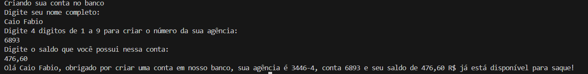

## Criando uma conta em um banco

Projeto referente ao bootcamp de Java da Santander feito pela DIO (Digital Innvation One)

>A função do código é criar um usuário de um banco pedindo para ele digitar seus dados via console 

_Imagem do console resultado final do código_
